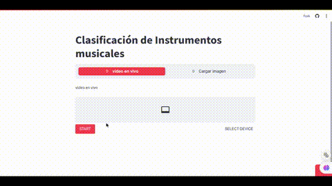

# Musical Instrument Classifier

This project is an academic endeavor aimed at developing a musical instrument classifier using machine learning techniques. This app is the implementation of the model that has already been trained.

## Overview
 
The musical instrument classifier is a machine learning model designed to identify different musical instruments from images. The model is trained using libraries such as TensorFlow, Keras, Scikit-learn, and NumPy, utilizing a custom-built dataset, the image processing is with cv2.

## Documentation

For training detailed and explanations about the project, please refer to the [complete documentation](https://drive.google.com/file/d/1DzTFqCULeKNm-jVsduC8QfnlXqg_Oqdn/view). Only in Spanish for academic reasons

### Labels

The labels are in Spanish, there are 10 classes.

| Spanish | English |
|----------|----------|
| Acordeón               | Accordion             |
| Armónica               | Harmonica             |
| Batería                | Drums                 |
| Cajón                  | Cajón (or Box Drum)   |
| Congas                 | Congas                |
| Guitarra Acústica      | Acoustic Guitar       |
| Guitarra Eléctrica     | Electric Guitar       |
| Piano                  | Piano                 |
| Trompeta               | Trumpet               |
| Violín                 | Violin                |

### Demo

[instrumental.streamlit.app](https://instrumental.streamlit.app/)

This is a demonstration of my project. Check out the GIF below to see it in action:

